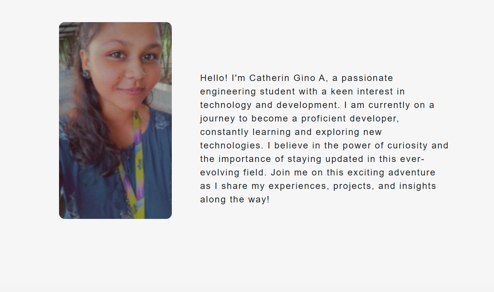

# 🌐 My Personal Portfolio Website

A responsive personal portfolio website built with **HTML, CSS, and JavaScript** to showcase my skills, projects, and journey as a developer.

🌟 **Live Website:** [catheringino.github.io/My-Website](https://catheringino.github.io/My-Website/)

---

## 📸 Preview


---

## ✨ Features
- 📖 **About Me** section introducing my journey in tech
- 💼 **Projects Showcase** with live demo links
- 📱 Fully responsive design for desktop and mobile
- 🎨 Clean and modern UI with simple navigation
- 📷 Profile picture and personalized introduction

---

## 🛠️ Built With
- **HTML5** – Page structure
- **CSS3** – Styling and responsive design
- **JavaScript** – Interactive elements

---

## 🚀 Getting Started
To view this website locally:
```bash
# Clone the repository
git clone https://github.com/CatherinGino/My-Website.git

# Open the folder
cd My-Website

# Open index.html in your browser
